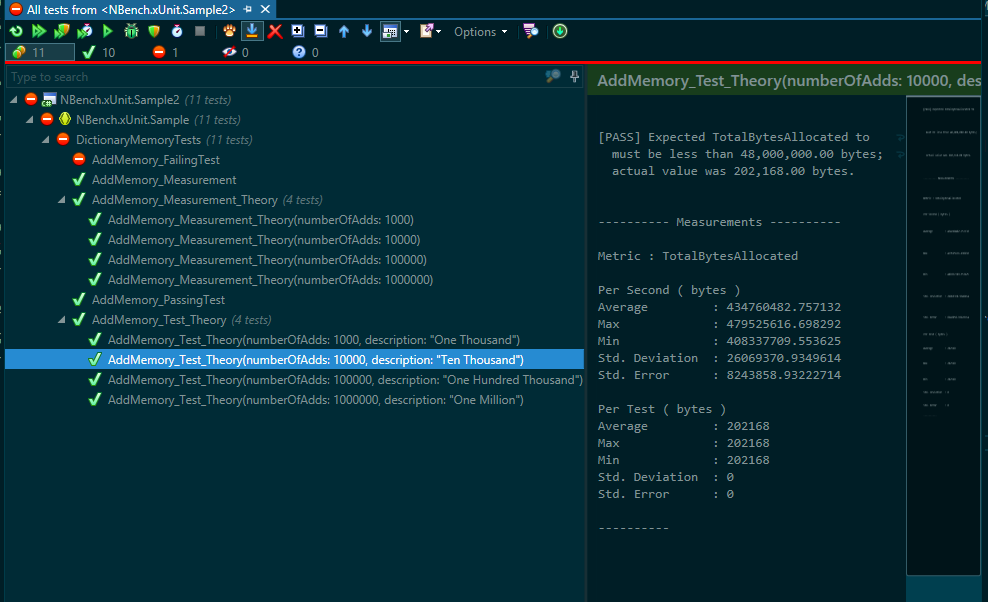

# Pro.NBench.xUnit

A project to allow [NBench](https://github.com/petabridge/NBench) tests to be discovered, executed, reported, and debugged using [xUnit](https://github.com/xunit/xunit) in ReSharper, and to a less polished extent, in Visual Studio Test Explorer. This allows you to not only test business logic validity, but also set performance criteria as part of your test suite.

Inspired by Andrea Angella's approach and article for [integrating NBench with NUnit](http://www.andreaangella.com/2016/03/nbench-performance-testing-nunit-resharper-integration/).

Please refer to the [Introduction to NBench](https://petabridge.com/blog/introduction-to-nbench/) as a starting point for information on how to configure NBench Tests and Measurements.

## Installation

To install Pro.NBench.xUnit (Integration of NBench, xUnit and ReSharper / Visual Studio Test Explorer), run the following command in the Package Manager Console

        Install-Package Pro.NBench.xUnit

## Usage

The Tests project serves as an example, and contains a set of three standard NBench test classes, attributed to collect Measurements, and Assert some conditions.

## Step 1.

Disable xUnit parrallelized execution, at either the Assembly, or Collection level. In the example, this is achived by adding the following line within the project:

       [assembly: CollectionBehavior(DisableTestParallelization = true)]

## Step 2.

Add a reference to the Pro.NBench.xUnit assembly, and include the following using statement for each class:

        using Pro.NBench.xUnit.XunitExtensions;

## Step 3. 

Include a constructor that includes a paramater of type ITestOutputHelper, and creates a new XunitTrace listener, as follows:

        public DictionaryMemoryTests(ITestOutputHelper output)
        {
            Trace.Listeners.Clear();
            Trace.Listeners.Add(new XunitTraceListener(output));
        }

## Step 4.

Annotate each NBench test with the following attribute:

        [NBenchFact]

You can also use xUnit Theories, by adding:

        [NBenchTheory]

The NBench Tests will be discovered and displayed in either the Resharper or Visual Studio Test Runners.

Breakpoints in the NBench benchmarks are fully supported for debugging.

**Please note, it is important that for accurate benchhmarking purposes, that the Tests are run in Release configuration, to allow compiler optimisations to be applied.**

When executed using ReSharper, the Tests are displayed, with the result of NBench Assertions, and any Measurements reported by each Test.

Visual Studio Test Explorer will also execute and debug the Tests, but presentation of results is less polished.

Please note, the example includes a variety of passing, and a deliberately failing Test.

## Future plans

- [x]  Release as NuGet package.

- [x]  Integration with xUnit Theories, to support paramaterised tests.

- [ ]  Possibly standard NBench Markdown Report output.

- [ ]  Possibly a Visual Studio Template for a pre-configured Test Project and Test Class.

--
**All Feedback Welcome!**

*David Paul McQuiggin, Pro-Coded.*
